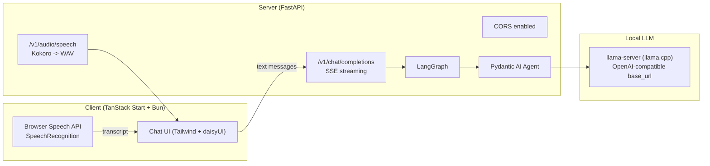

# Local Voice Chat (TanStack Start + FastAPI + llama.cpp + Kokoro)

Local-first chat UI with **Browser Speech API** for speech-to-text, a FastAPI server that exposes an **OpenAI-compatible** `/v1/chat/completions` streaming endpoint, and a **Kokoro** TTS endpoint (`/v1/audio/speech`) you can use to generate WAV audio.

## Status

### Implemented
- Frontend (TanStack Start):
  - Chat UI with message history (localStorage)
  - Text input
  - Voice input via **Browser Speech API** (speech-to-text on the client)
  - Sends user messages to backend as text
  - Receives assistant response as **streamed text** (SSE OpenAI-style chunks)

- Backend (FastAPI):
  - `POST /v1/chat/completions` (OpenAI-compatible shape, SSE streaming)
  - LangGraph workflow that calls a Pydantic AI Agent (backed by local `llama-server`)
  - `POST /v1/audio/speech` (OpenAI-compatible-ish shape) that returns **WAV** (PCM16, 24 kHz) using Kokoro

### Not implemented yet
- Chat endpoint returning audio+text together (punctuation segmentation + Kokoro)
- Server-side STT (Moonshine) (we are “Browser Speech API only” right now)
- Tool calls / agent tools beyond basic response

---

## Architecture (current)



---

## Repo structure (typical)

```
server/
  app.py
  tts_kokoro.py
client/
  src/
    routes/
    components/
    lib/
  vite.config.ts
  package.json
```

---

## Prerequisites

### System

* **Python 3.12+** (3.12 recommended on Windows for wheels)
* **uv** (Astral) for Python env + installs
* **Bun** for frontend runtime
* A locally running **llama-server** (llama.cpp) with a model file

### Network

* First-time installs require internet access (Python deps, spaCy model wheel, etc.)
* Runtime is local (browser <-> localhost)

---

## Backend setup (FastAPI + uv)

> Windows PowerShell examples below. macOS/Linux commands are similar.

### 1) Create the uv virtual environment

From `server/`:

```powershell
uv venv --seed
.\.venv\Scripts\activate
```

If you already created `.venv` without pip:

```powershell
# Add pip into the existing uv venv
uv pip install pip
```

> If you manually copied pip from another venv, you can keep that, but the recommended fix is `uv venv --seed` (or `uv pip install pip`) so the env is consistent.

### 2) Install Python dependencies

```powershell
uv pip install fastapi uvicorn langgraph pydantic-ai kokoro numpy
```

### 3) Install the spaCy English model (required for Kokoro English G2P)

Kokoro’s English G2P path may require `en_core_web_sm`. Install it as a wheel:

```powershell
python -m spacy info en_core_web_sm --url
```

Copy the URL it prints, then:

```powershell
uv pip install "<PASTE_URL_HERE>"
```

If you prefer the traditional way (requires pip to work inside the env):

```powershell
python -m spacy download en_core_web_sm
```

### 4) Configure environment variables

Create `server/.env` or export variables in your shell.

Required for the **Agent -> llama-server** path:

```powershell
$env:OPENAI_BASE_URL="http://127.0.0.1:8080/v1"
$env:OPENAI_API_KEY="local"
$env:LOCAL_MODEL_NAME="local-model"
```

### 5) Run the server

```powershell
uvicorn app:app --host 127.0.0.1 --port 8000 --reload
```

---

## llama-server (llama.cpp)

Run llama-server separately (example only; adapt to your model + flags):

```powershell
# Example only
.\llama-server.exe -m .\models\your-model.gguf --host 127.0.0.1 --port 8080
```

Make sure `OPENAI_BASE_URL` matches that host/port and ends with `/v1`.

---

## Frontend setup (TanStack Start + Bun + Tailwind + daisyUI)

From `client/`:

### 1) Install dependencies

```bash
bun install
```

### 2) Set env vars

Create `client/.env`:

```bash
VITE_API_BASE_URL=http://127.0.0.1:8000
VITE_MODEL_NAME=local-model
```

### 3) Run dev server

```bash
bun run dev
```

Open the dev URL (usually `http://localhost:5173`).

---

## CORS (Option B: FastAPI CORS enabled)

If the client runs on `http://localhost:5173` and server on `http://127.0.0.1:8000`, ensure FastAPI has CORS middleware allowing that origin (and `POST`, `OPTIONS`, headers).

Typical dev setup:

* allow origins:

  * `http://localhost:5173`
  * `http://127.0.0.1:5173`
  * (plus any other ports you actually use)

---

## API endpoints

### Chat (OpenAI-compatible, streaming)

`POST /v1/chat/completions`

Request:

```json
{
  "model": "local-model",
  "messages": [{ "role": "user", "content": "Hello" }],
  "stream": true
}
```

Response:

* `text/event-stream` (SSE)
* yields OpenAI-style `chat.completion.chunk` payloads
* ends with `data: [DONE]`

### TTS (Kokoro, returns WAV)

`POST /v1/audio/speech`

Request:

```json
{
  "model": "kokoro-82m",
  "input": "Hello from Kokoro.",
  "voice": "af_heart",
  "response_format": "wav",
  "speed": 1.0
}
```

Response:

* `audio/wav` (PCM16, 24 kHz)

Example:

```bash
curl http://127.0.0.1:8000/v1/audio/speech ^
  -H "Content-Type: application/json" ^
  -d "{\"model\":\"kokoro-82m\",\"input\":\"Hello\",\"voice\":\"af_heart\",\"response_format\":\"wav\",\"speed\":1.0}" ^
  --output speech.wav
```

---

## Troubleshooting

### “No module named pip” (uv venv)

* Fix: `uv venv --seed` OR `uv pip install pip`.
* Avoid copying pip between venvs unless you’re unblocking yourself temporarily.

### Kokoro startup fails with spaCy download / SystemExit

* Install `en_core_web_sm` ahead of time (wheel install is most reliable).
* Then restart the server.

### Browser Speech API not working

* Some browsers/OS setups don’t support `SpeechRecognition`.
* Check your browser devtools console for permission or “not supported” errors.

### CORS errors

* Ensure the exact origin in the browser address bar is in `allow_origins`:

  * `localhost` vs `127.0.0.1` matters
  * port matters (`5173` vs `3000`)

---

## Roadmap (next)

1. Integrate Kokoro into the chat response pipeline:

   * server buffers generated text to punctuation boundaries
   * generates WAV per segment
   * streams segment events `{text, audio}` to client
2. Update frontend to:

   * play audio segments sequentially
   * display text segments as they arrive

```

### Why these uv/spaCy steps are in the README
- `uv venv` can create environments without pip unless you seed it; `uv venv --seed` and `uv pip install pip` are the intended fixes. :contentReference[oaicite:0]{index=0}  
- The Kokoro English pipeline path can trigger spaCy model installation; installing `en_core_web_sm` ahead of time avoids runtime downloads and the “pip missing” crash. :contentReference[oaicite:1]{index=1}  
- FastAPI’s recommended replacement for `on_event` is lifespan handlers. :contentReference[oaicite:2]{index=2}  
- The `/v1/audio/speech` endpoint shape is based on OpenAI’s audio/speech documentation (we’re matching the request fields for compatibility even though we’re using Kokoro locally). :contentReference[oaicite:3]{index=3}

If you want, I can also produce a `server/README.md` and `client/README.md` split (cleaner when the repo grows), and add a `Makefile`/PowerShell script that boots llama-server + FastAPI + client in one command.
::contentReference[oaicite:4]{index=4}
```
